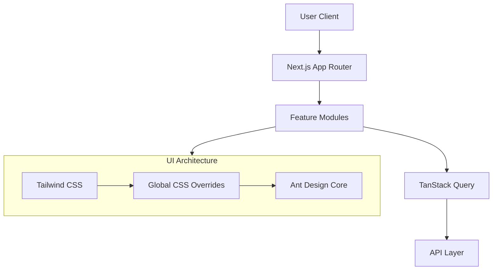

# AlsoNotify - Frontend


## 🚀 Overview

**AlsoNotify** is a modern project tracker and notification management system. The frontend is built with **Next.js 15+ (App Router)** and features a highly customized UI that leverages **Ant Design** for robust component functionality while using **Tailwind CSS v4** for advanced styling and layout. The design system mimics modern, accessible aesthetics (Radix/Shadcn-like variables) but is implemented primarily through Ant Design overrides.

## 🛠️ Technology Stack

- **Framework:** [Next.js 15+](https://nextjs.org/) (App Router)
- **Language:** [TypeScript](https://www.typescriptlang.org/)
- **UI Library:** [Ant Design (v6)](https://ant.design/) - _Primary component library for Inputs, Modals, Tables, etc._
- **Styling:** [Tailwind CSS v4](https://tailwindcss.com/) - _Used for layout and overriding AntD styles._
- **Icons:** [Lucide React](https://lucide.dev/) - _Extensive usage for system icons._
- **State Management:** [TanStack Query](https://tanstack.com/query/latest) (Server state) & React Context (Client state).
- **Calendar:** [FullCalendar](https://fullcalendar.io/) - _With custom AntD-styled wrappers._
- **Charts:** [Recharts](https://recharts.org/)
- **Animations:** [Framer Motion](https://www.framer.com/motion/)

## 📂 Project Structure

```bash
src/
├── app/                # Next.js App Router pages
├── components/         # Component Architecture
│   ├── common/         # Shared app-wide components (Topbar, Sidebar, etc.)
│   ├── features/       # Feature-specific domains (Calendar, Mail, Tasks)
│   ├── modals/         # Ant Design Modal implementations (Forms, Dialogs)
│   ├── ui/             # Custom atomic UI elements (AccessBadge, StatusBadge)
│   └── workspace/      # Project/Workspace management components
├── context/            # React Context (Timer, Auth)
├── hooks/              # Custom Hooks (useCalendar, useAuth)
├── services/           # Axios-based API services
├── styles/             # Global styles & AntD overrides (globals.css)
└── types/              # TypeScript interfaces & DTOs
```

## 🏗️ Architecture & Design System

The application uses a unique hybrid approach to UI:

1.  **Component Core**: Complex interactions (DatePickers, Selects, Modals) are powered by **Ant Design** to ensure robustness.
2.  **Visual Layer**: A global CSS override system (`src/styles/globals.css`) transforms Ant Design components to match a bespoke, modern aesthetic.
    - _Variables_: Uses `oklch` color variables (similar to Shadcn UI).
    - _Overrides_: Customizes AntD class names (`.ant-picker`, `.ant-select`) to remove default borders and apply custom shadowing/rounding.
3.  **Layout**: **Tailwind CSS** utility classes handle all spacing, grid layouts, and responsiveness.



## 🚀 Getting Started

### Prerequisites

- **Node.js:** v18+ (Required for Next.js 15)
- **Package Manager:** npm (Recommended) or bun (Optional)

### Installation

1.  **Clone the repository:**

    ```bash
    git clone <repository-url>
    cd alsonotify-new-ui
    ```

2.  **Install dependencies:**

    ```bash
    npm install
    # or
    bun install
    ```

3.  **Environment Setup:**
    Create a `.env.local` file:

    ```env
    NEXT_PUBLIC_API_URL=http://localhost:4000
    ```

4.  **Run Development Server:**
    ```bash
    npm run dev
    # or
    bun dev
    ```

## 📜 Scripts

| Script      | Description                           |
| :---------- | :------------------------------------ |
| `dev`       | Starts the Next.js development server |
| `build`     | Builds the application for production |
| `lint`      | Runs ESLint                           |
| `typecheck` | Runs TypeScript compilation check     |
| `test`      | Runs Vitest suite                     |

---

**Note**: When contributing, ensuring you verify modifications against the `globals.css` file as it heavily dictates component appearance.
